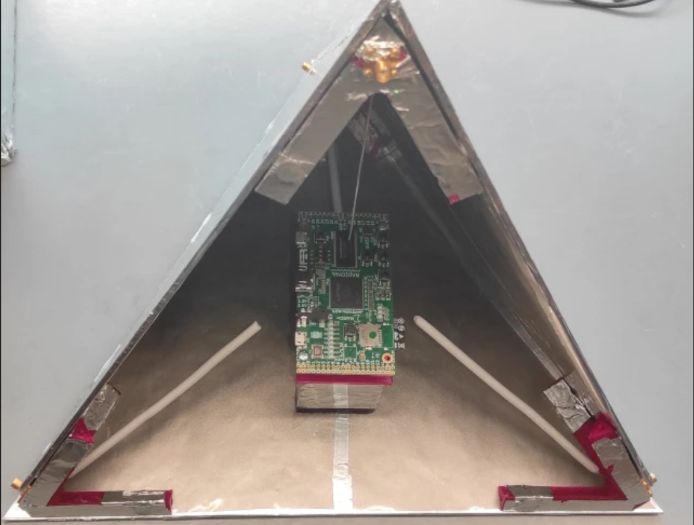
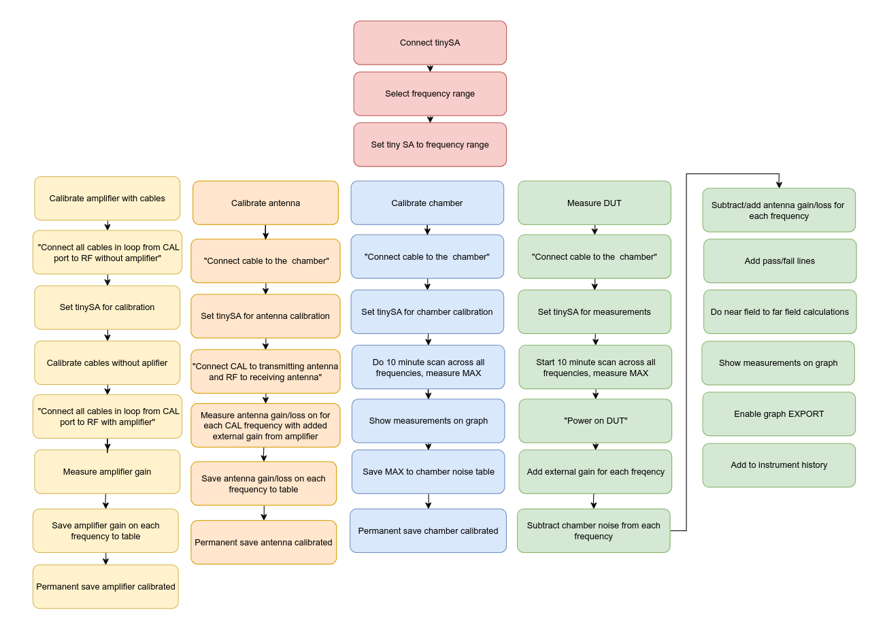
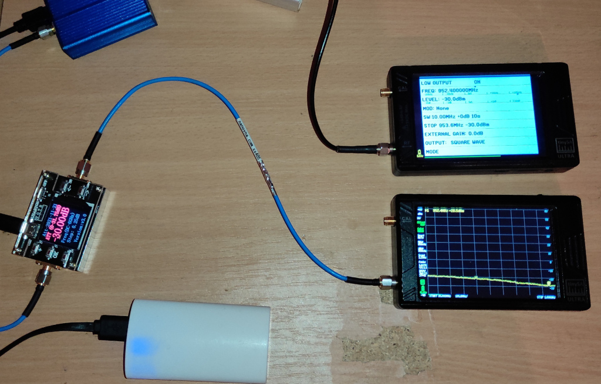
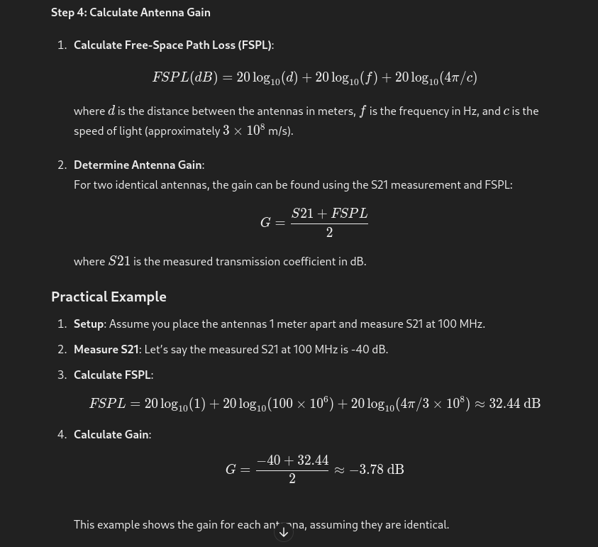
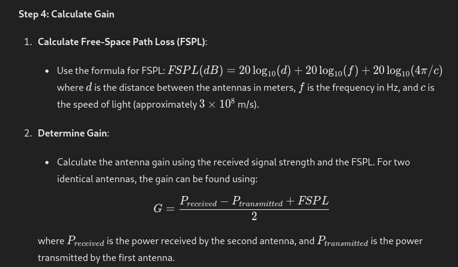
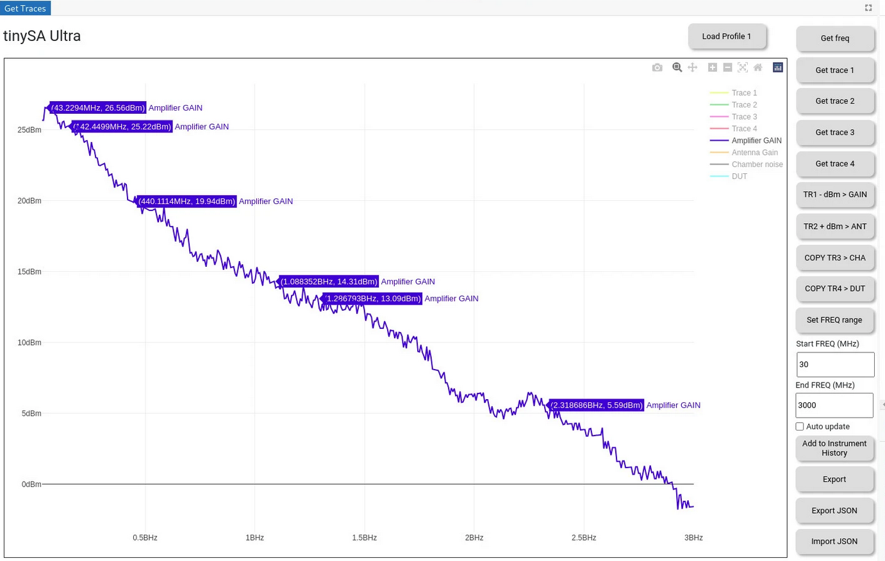
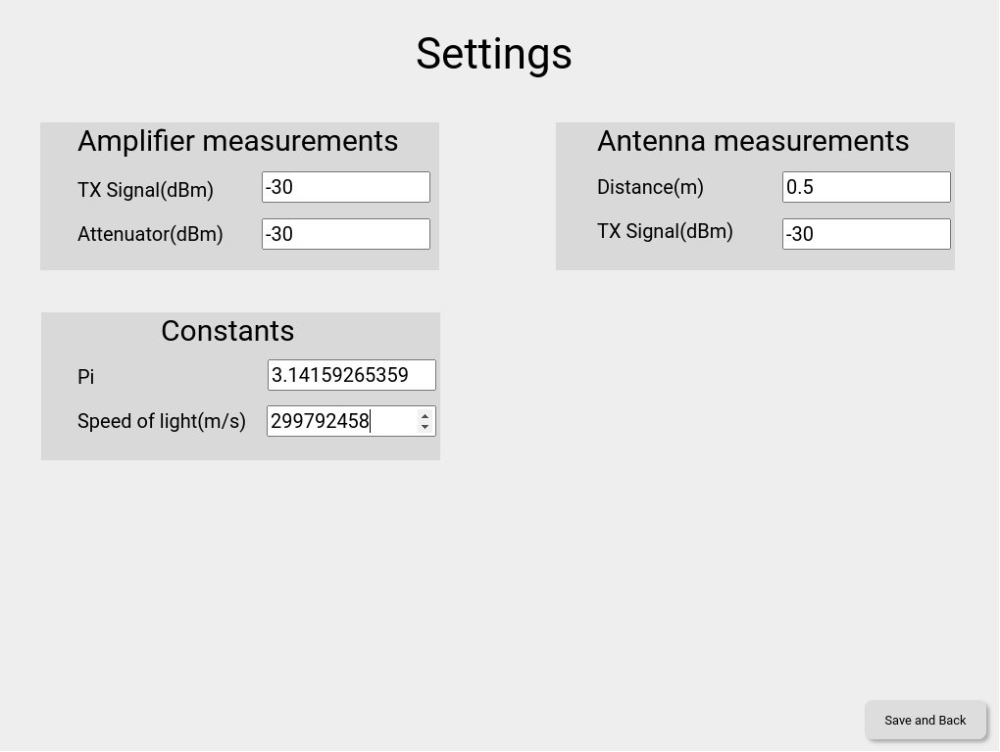

# EMC-experiments - EEZ Studio EMC

### THIS IS STILL PROOF OF CONCEPT, ONCE I CONFIRM EVERYTHING IS WORKING I WILL REMOVE THIS LINE !!!

### Check what levels your equipment can handle, tinySA is very sensitive so be careful!

### Do not broadcast any frequency out of its legal limits!

### If you use an amplifier connect it to the receiving port!

## Chamber

As we now have a pyramid chamber we can do measurements.

## Initial Software idea

## How to use

Download and install 

Download 

You can first do measurements then connect your SA and get measurements into the computer.

## Measurements

### Amplifier

Be careful not to burn your equipment, use attenuators to lower signal strength. 

Once you are sure the signal is not too strong you can decrease attenuation.

With these measurements we will get amplification for each frequency we will measure later.

Setup one TinySA in signal generator mode.

Set FREQ, in our case we will have this set to 500MHz.

Set level - in our case, that is -30dBm

Set SWEEP to some range in our case SPAN will be 1GHz.

Set SWEEP time - in our case 600s

Press BACK 

On the attenuator set attenuation to for high level - in our case -30dBm

Connect attenuator to receiving tiny

In Spectrum analyzer mode set FREQUENCY

START 30 MHz, STOP 1GHz

Enable Trace1 

Set CALC to MAX HOLD

on TX tiny Start SWEEP and LOW output ON

Wait until you get a nice filled line (at least 10 minutes as that is one pass).

Once you have done measurements you can FREEZE that trace.

You can turn off your sending tiny and disconnect the receiving one.

Open EEZ measuring project, connect receiving tiny, and start the project.

Click on Settings

Change amplification settings - "TX Signal(dBm)" and "Attenuator(dBm)"

Click on Save and Back

Click on "Get trace 1"

Click on "TR1 - dBm > GAIN"

Now you can save the graph with "Add to Instrument History"

Or you can use "Export JSON" and "Import JSON"

On the graph, you can enable or disable some lines by clicking on their name in the top right corner.

Also on the top right corner of the Plotty you will find the autoscale button.

### Antennas

We need to have two identical antennas.

You will need to find low noise location, for example basement.

We will use the same range for the antennas from 30MHz to 1GHz so you will have the same setup.

Distance antennas (best 1m or more) I did 0.5m as then lower power is needed.

Use some holder to hold antennas at some level (like 1m).

Connect one antenna to TX and one to RX tiny.

Do not connect an amplifier, you can do everything without one.

Use the same settings on both tinySA devices.

Now set "TRACE 2" on the RX device to MAX HOLD.

Star SWEEP with TX device and you should get a nice line after some time (10-30min).

Now you have TRACE 1 and TRACE 2

Connect RX device to EEZ measuring project and get TRACE 1 and TRACE 2

Click on Settings

Change amplification settings - "TX Signal(dBm)" and "Attenuator(dBm)"

Change Antenna Measurements settings - Distance(m)" and "TX Signal(dBm)" <- this can be different than TX Signa used for the amplifier.

Click on Save and Back

Click on "Get trace 1"

Click on "TR1 - dBm > GAIN"

Click on "Get trace 2"

Click on "TR2 + dBm > ANT"

Now you should also have antenna characteristics.

I got those formulas from chatGPT so I am still not confident that all calculations are correct.

## Chamber noise

Use amplifier and MAX hold and save to TRACE 3

Click on "COPY TR3 > CHA" to get chamber noise inside the studio.

## DUT - calculations are still not in place!!!

Put the device into the chamber.

Use amplifier and MAX hold and save to TRACE 5

Click on "COPY TR4 > DUT" to get device measurements into a graph.

Export your JSON and add it to instrument history, as then you can reuse it any time!

V1 version of the software

Settings screen

## Funding

This project is funded through the [NGI Zero Entrust Fund](https://nlnet.nl/entrust), a fund
established by [NLnet](https://nlnet.nl) with financial support from the European Commission's
[Next Generation Internet](https://ngi.eu) program. Learn more on the [NLnet project page](https://nlnet.nl/project/Balthazar-Casing/).

https://nlnet.nl/project/BB3-CM4

## Check up our blogposts

https://intergalaktik.eu/news

## Contact us

Discord: https://discord.gg/qwMUk6W
