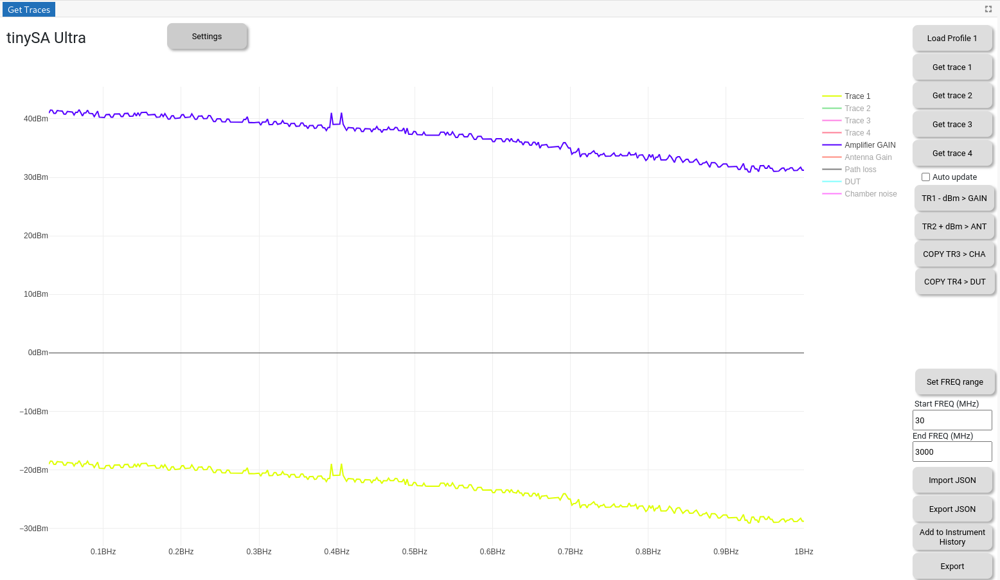

# EMC-experiments - EEZ Studio EMC

initial Software idea

V1 version of software

## Work on this project is financed by NLnet foundation

This project was funded through the NGI0 Entrust Fund, a fund established by NLnet with financial support from the European Commission's Next Generation Internet programme, under the aegis of DG Communications Networks, Content and Technology under grant agreement No 101069594.

https://nlnet.nl/project/BB3-CM4

## Check up our blogposts

## Contact us

Discord: https://discord.gg/qwMUk6W
