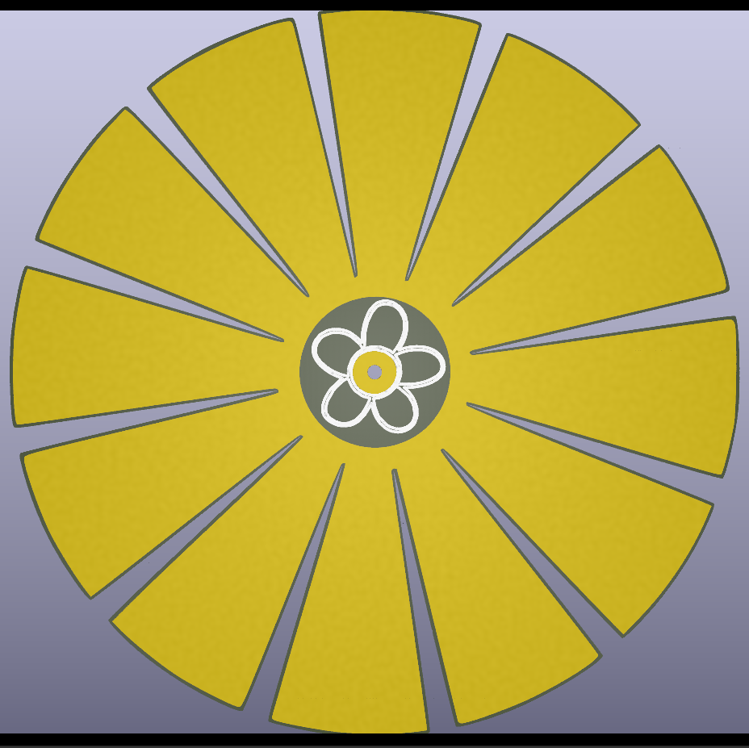

# Experimental PCB antenna for EMC chamber

## Antenna TOP

This is now antenna TOP looks like

For antenna We will use 10cm of cooper wire and put this antenna on top of it.

The idea is to pick up more stronger signals, and not to be tuned to any freqency in our meassrement range.

We need wide band low amplification from 30MHz - 1GHz ( or more if possible ).